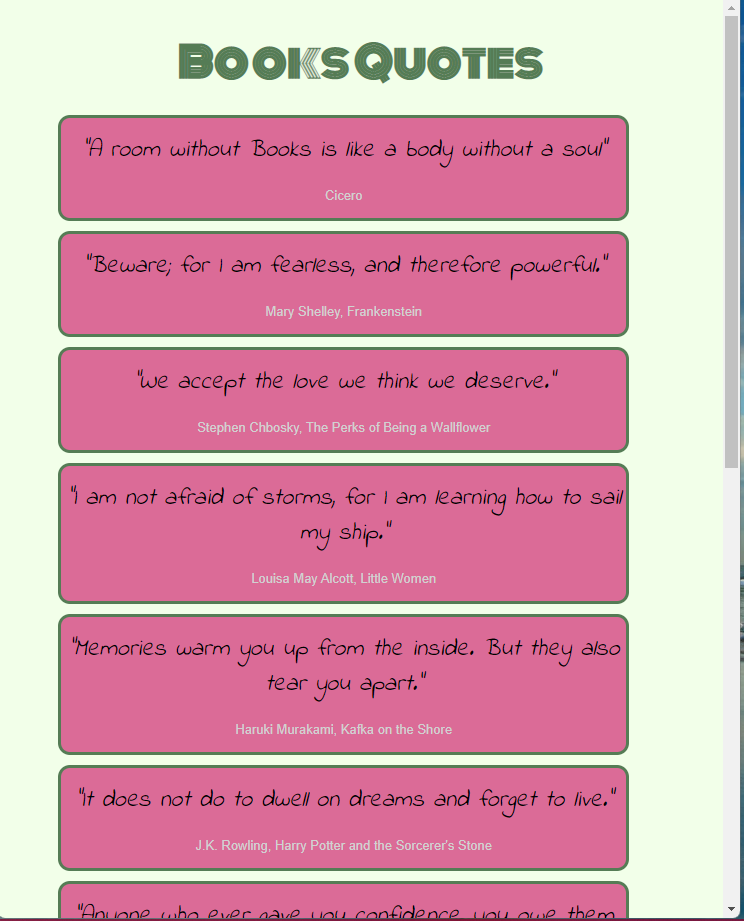
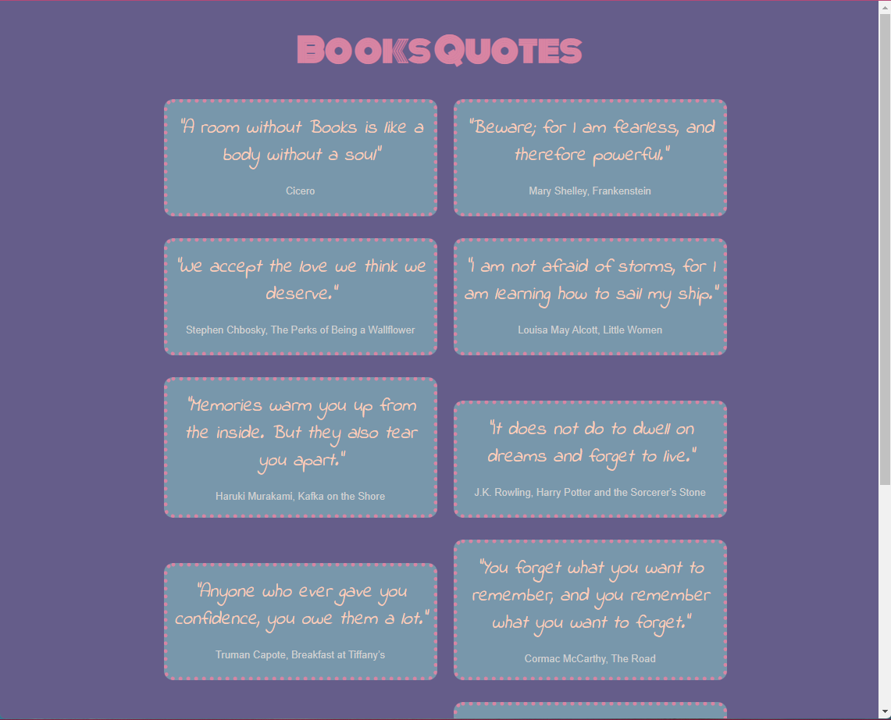
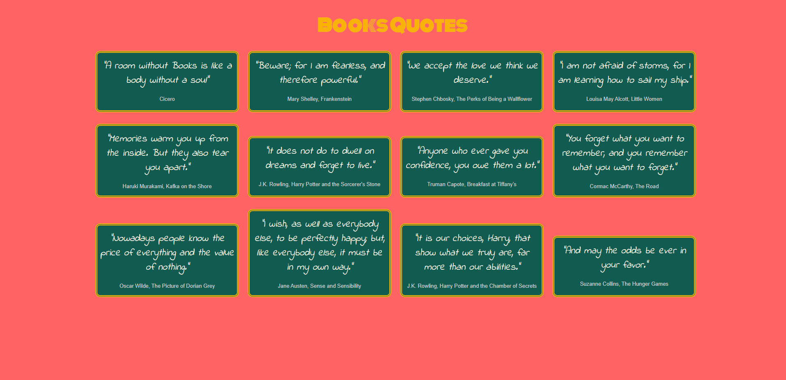
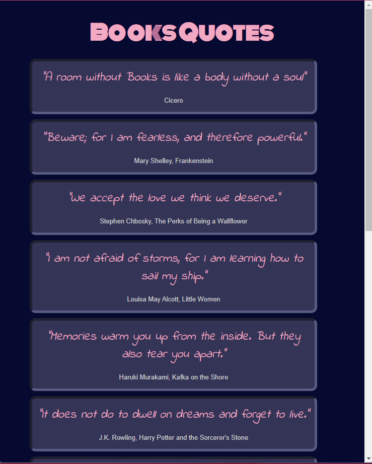
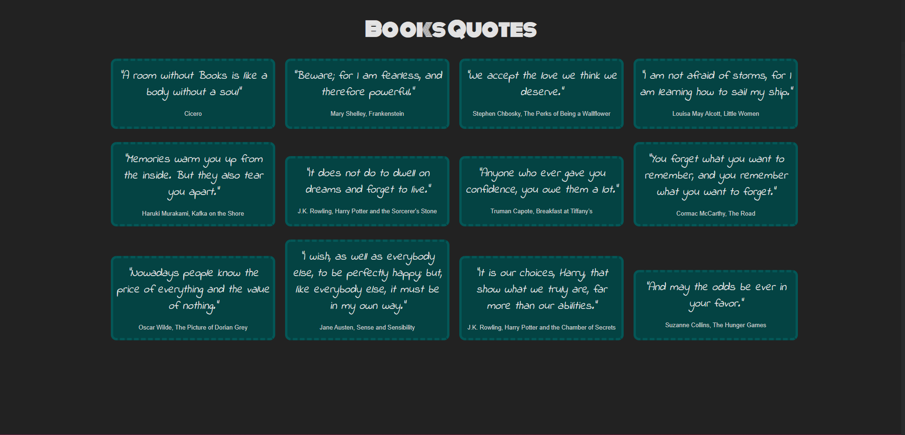

# Book Quotes - Responsive Web Page

Welcome to the **Book Quotes** web page repository! This simple yet elegant project serves as an example of how to create a **responsive web page** using only vanilla HTML and CSS. It was designed to demonstrate the concepts and techniques taught during the **CSS Responsive** session, without previous knowledge of flex, grid and css variables

## Overview

This project showcases a responsive design that adapts to different screen sizes and user preferences, including color schemes. The page content focuses on Book Quotes, providing an engaging and relatable example for students to learn from.

### Features

- **Responsive Design**: Adapts seamlessly to various screen sizes, from mobile devices to large desktops.
- **Color Scheme Adaptation**: Automatically adjusts to the user's preferred color scheme (light or dark mode).
- **Vanilla HTML and CSS**: Built without external frameworks to focus on the fundamentals of responsive design.

## Purpose

The purpose of this repository is to provide a practical example for students to understand and implement responsive design techniques, including:

- Media queries for different screen sizes
- Utilizing `@media (prefers-color-scheme)` to align with user preferences

## Technologies

- HTML
- CSS

## Preview

### Light Mode

#### Small Screen

#### Medium Screen (Width bigger than 800)

#### Full Screen (Width bigger than 1200)

### Dark Mode

#### Small Screen

#### Full Screen (width bigger than 800)

